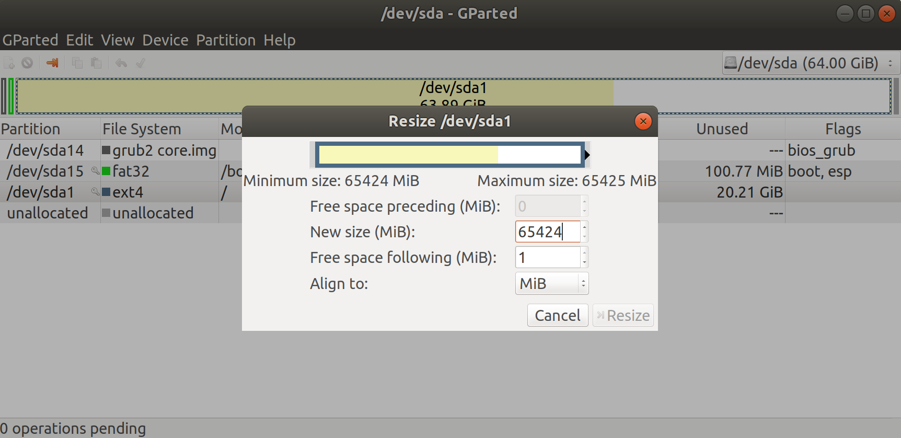

# Building from sources (Android)

The MixedReality-WebRTC library for Android takes the form of an Android archive (`.aar`). This archive is built using the scripts located in `tools/build/libwebrtc` and `tools/build/android`, in that order.

TODO - More detailed steps. See various README.md in those folders in the meantime.

## Setup the Linux environment

A Linux environment is required to build the `libwebrtc` Android library, and therefore the Android archive of MixedReality-WebRTC. This can be done in several ways:

- From Windows, using Windows Subsystem for Linux 2 (WSL2); note that WSL1 is not compatible and will fail due to issues with the filesystem.
- From Windows, using a virtual machine, for example with the Hyper-V Manager.
- Using an actual installation on a physical machine. Installing Linux on a physical machine is not covered in this documentation, but is the easiest and fastest if available, as it avoids any issue with virtualization and provides the best building performance.

### Using WSL2

TODO...

### Using an Hyper-V virtual machine

Start the Hyper-V Manager and select in the menu **Action** > **Quick Create...** to create a Ubuntu 18.04 VM with the quick-create assistant.


- Select **Ubuntu 18.04 LTS**; this is the recommended distribution and version, even if newer releases exist they might not be compatible, as MixedReality-WebRTC uses an old milestone (M71) where 18.04 was the latest known release.
- Under **More options**, make sure that some Network is available (generally via the **Default Switch**) so that the VM has Internet access; this is required ot download the tools and source code in the VM.

Click **Create Virtual Machine** and wait for the assistant to finish.

Then **do not start the VM** right away; instead edit its disk to increase the size. The default VM size is 16GB, which is not enough for the entire set of tools needed to build the Android archive of MixedReality-WebRTC (MixedReality-WebRTC code, libwebrtc code, Android-Studio, Android SDK/NDK). Resizing the disk takes 2 steps:

1. From the Hyper-V Manager, resize the virtual disk while the VM is not running.
2. From withint the VM, resize the Linux partition to use the new space available from the virtual disk.

First, select the newly-created VM in the Hyper-V Manager and open the settings panel, either right-clicking on the VM or selecting the **Settings...** option in the right panel.

- Navigate to **SCSI Controller** > **Hard Drive** and click **Edit**.
- Select **Expand**.
- Enter **64 GB** for the new size.
- Click **Next** then **Finish**, and wait for the assistant to terminate resizing the virtual disk.

Next, start the VM and follow through the setup, making sure to **select a username and password, and DISABLE automatic login** as this may cause issues with xrdp. Normally if everything went right then _Enhanced Session_ should be available, which means you can connect to the VM using remote desktop, which provides much largeer dispaly resolutions and much improved performance. Otherwise the default _Basic Session_ is available as a fallback but displays very slowly.

Once logged in, to resize the main partition:

- Install `gparted`; the default Ubuntu tool doesn't seem to work on virtual disks. For example from a terminal:
  ```sh
  sudo apt install gparted
  ```
- Start `gparted` as root, as it requires elevated privilege to modify the partition table:
  ```sh
  sudo gparted
  ```
- Locate the root partition, it should have a size around 15~16GB already. This is normally an `ext4` type of partition mounted at `/` (root).
- Right-click it and select **Resize/Move**
- Drag the right border of the partition to the right to maximize its size; this should amount to about 64GB.
- Click **Resize**.
- Verify from a terminal that the partition was resized:
  ```sh
  $ df -h
  Filesystem      Size  Used Avail Use% Mounted on
  /dev/sda1        62G   42G   21G  68% /
  ```



Finally, make sure Git and Python are installed.

```sh
sudo apt install git python
```

## Clone the MixedReality-WebRTC repository

In the following we work in `~/dev` for simplicity. In a terminal, clone the repository:

```sh
cd ~/dev
git clone --recursive https://github.com/microsoft/MixedReality-WebRTC -b master mrwebrtc
```

This clones the repository in `~/dev/mrwebrtc`, and makes the build tools available at `~/dev/mrwebrtc/tools/build`.

## Build `libwebrtc`

In a terminal, run the configure script to prepare the checkout.

```sh
cd ~/dev/tools/build/libwebrtc
./config.sh -d ~/dev/webrtc -b branch-heads/71 -t android -c arm64
```
```

> [!WARNING]
>
> Do not use the "Fast Clone" option (`-f`); this is reserved for CI and requires additional steps to work, which are not detailed here. If used alone this will produce an invalid checkout with missing

Then do the actual checkout with the `checkout.sh` script. This generally takes a decent amount of time, as `libwebrtc` is particularly large.

```sh
./checkout.sh

Eventually after several minutes the script finishes. We can now build `libwebrtc` itself. We use the Release configuration by default for increased performance. It is possible to build a Debug configuration if needed, for example to get the internal `libwebrtc` logs printted in `logcat`, which usually helps debugging issues.

```sh
./build.sh -c Release
```

## Install Android Studio

Download [Android Studio](https://developer.android.com/studio/) from its official website and install it. On Linux this just mean unzipping it in a selected location.

```sh
mkdir ~/dev
cd ~/dev
tar -xzvf ~/Downloads/android-studio-ide-193.6514223-linux.tar.gz
```

You can start it by running `studio.sh` located in the `bin/` sub-folder.

```sh
cd ~/dev/android-studio/bin
./studio.sh
```

On first start Android Studio will do its best to force the install of the lastest Android SDK and tools; it is **very** difficult to work around this and install a different version. Unfortunately MixedReality-WebRTC currently has lower version requirements (mainly due to Unity's own requirements) therefore the latest version is useless here. It is easiest anyway to let Android Studio install the default tools, and then later instal the correct versions (and possibly remove any unused version to save disk space).

Once the default setup is done, open the project located at 